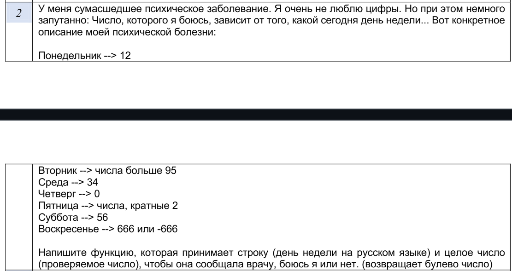

# Лабораторная работа №1. Вариант 2

## Основные сведения по ЛР
1. Функция `AfraidNumber(const std::string& str, const int& num)`
   выполняет проверку по условию задачи, что введённый день недели соотвествует заданому числу.
2. Функция `IsCorrect(const std::string& str)`
   осуществляет валидацию, введённого дня недели. В частности проверяет, что количество символов в строке больше 4, т.к. самый короткий день недели это "Среда", и что каждый символ в строке является кириллическим.